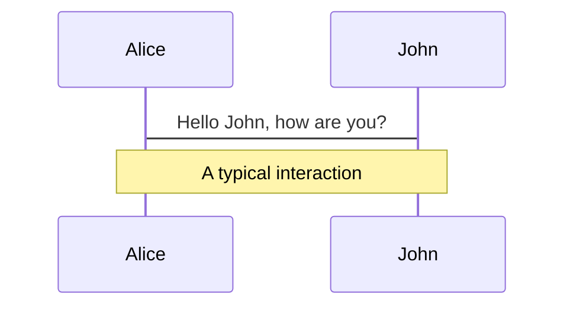
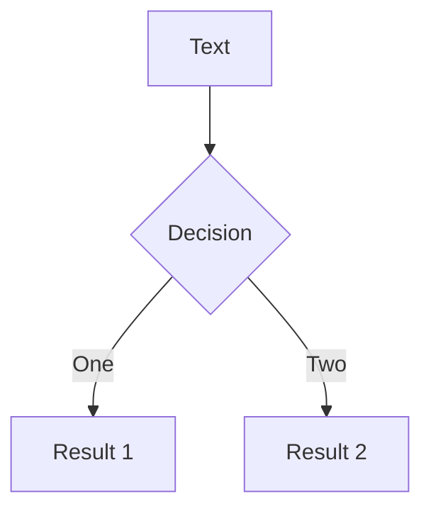

---
# try also 'default' to start simple
theme: default
# random image from a curated Unsplash collection by Anthony
# like them? see https://unsplash.com/collections/94734566/slidev
background: https://source.unsplash.com/collection/94734566/1920x1080
# apply any windi css classes to the current slide
class: 'text-center'
# https://sli.dev/custom/highlighters.html
highlighter: shiki
# show line numbers in code blocks
lineNumbers: false
# some information about the slides, markdown enabled
info: |
  ## Slidev Starter Template
  Presentation slides for developers.

  Learn more at [Sli.dev](https://sli.dev)
---

[//]: # (Slide Start {{{)

# Great on their Own, Even Better Together

## Application Development with
## Python, Typer, and Poetry

<div class="container my-5">
  &nbsp;
</div>

### Gregory M. Kapfhammer

### CodepaLOUsa 2021

[//]: # (Slide End }}})

---

[//]: # (Slide Start {{{)

# <em>Okay</em>, what is this about?

<style>
  h2 {
    font-size: 36px;
    @apply text-orange-600 mb-4;
  }
</style>

<br>

<div v-click>

## Key Questions

> What are the **benefits** and **challenges** associated with using the Python
> language, Typer, and Poetry for creating command-line
> applications?

</div>

<br>

<div v-click>

## Intended Audience

> An **adventuresome** technology enthusiast who wants to explore how both a
> new **paradigm** and software **tools** can improve their development skills!

</div>

<div v-click>

<div class="flex row">

<uim-rocket class="text-6xl ml-8 mt-5 text-blue-600" />

<div class="text-3xl font-bold mt-8 ml-4">
Let's create a command-line application in Python!
</div>

</div>

</div>

[//]: # (Slide End }}})

---

[//]: # (Slide Start {{{)

# Why focus on Python programming?

<style>
  h2 {
    font-size: 36px;
    @apply text-orange-600 mb-4;
  }
</style>

<br>

<div v-click>

## Prevalence of Python

> Python is consistently ranked as one of the **top programming languages**
> for web development, data science, machine learning, and general programming

</div>

<br>

<div v-click>

## Command-Line Interface

> Programmers who start using Python through Jupyter notebooks may need to
> create **tools** and **servers** that require a command-line interface

</div>

<div v-click>

<div class="flex row">

<mdi-help-box class="text-6xl ml-8 mt-4 text-blue-600" />

<div class="text-3xl font-bold mt-8 ml-4">
What is challenging about programming in Python?
</div>

</div>

</div>

[//]: # (Slide End }}})

---

[//]: # (Slide Start {{{)

<style>
  li {
  font-size: 26px;
  margin-bottom: 1px;
  }
</style>

<div class="flex row">

<mdi-package-variant class="text-8xl ml-6 mt-8 text-orange-600" />

<div class="text-6xl text-true-gray-600 font-bold mt-8 ml-4">
Creating virtual environments
</div>

<div class="text-6xl text-true-gray-600 font-bold mt-13 mr-15">
<ul>
<li> virtualenv </li>
<li> venv </li>
<li> pipenv </li>
</ul>
</div>

</div>

<v-clicks>

<div class="flex row">

<mdi-package-up class="text-8xl ml-6 mt-8 text-orange-600" />

<div class="text-6xl text-true-gray-600 font-bold mt-8 ml-4">
Publishing packages to PyPI
</div>

<div class="text-8xl text-true-gray-600 font-bold mt-15 mr-19">
<ul>
<li> twine </li>
<li> flit </li>
<li> setup.py </li>
</ul>
</div>

</div>

</v-clicks>

<v-clicks>

<div class="flex row">

<mdi-console class="text-8xl ml-6 mt-8 text-orange-600" />

<div class="text-6xl text-true-gray-600 font-bold mt-8 ml-4">
Making command-line interfaces
</div>

<div class="text-8xl text-true-gray-600 font-bold mt-14 mr-19">
<ul>
<li> argparse </li>
<li> fire </li>
<li> click </li>
</ul>
</div>

</div>

</v-clicks>

[//]: # (Slide End }}})

---

[//]: # (Slide Start {{{)

<div class="flex row">

<div class="text-7xl text-orange-600 font-bold mt-5 ml-4 mb-4">
What are the downsides of these tools?
</div>

</div>

<div v-click>

<div class="flex row">

<mdi-alert-octagram class="text-6xl ml-8 mt-6 text-blue-600" />

<div class="text-3xl font-bold mt-10 ml-4">
virtualenv uses the requirements.txt file
</div>

</div>

</div>

<div v-click>

<div class="flex row">

<mdi-alert-octagram class="text-6xl ml-8 mt-6 text-blue-600" />

<div class="text-3xl font-bold mt-10 ml-4">
twine requires use of complicated setup.py file
</div>

</div>

</div>

<div v-click>

<div class="flex row">

<mdi-alert-octagram class="text-6xl ml-8 mt-6 text-blue-600" />

<div class="text-3xl font-bold mt-10 ml-4">
argparse does not verify command-line arguments
</div>

</div>

</div>

[//]: # (Slide End }}})

---

[//]: # (Slide Start {{{)

<div class="flex row">

<div class="text-7xl text-orange-600 font-bold mt-5 ml-4 mb-4">
How to easily create command-line tools using modern Python?
</div>

</div>

<div v-click>

<div class="flex row">

<uim-repeat class="text-6xl ml-8 mt-6 text-blue-600" />

<div class="text-5xl font-bold mt-8 ml-4">
Typer: <code>https://typer.tiangolo.com/</code>
</div>

</div>

</div>

<div v-click>

<div class="flex row">

<uim-layer-group class="text-6xl ml-8 mt-6 text-blue-600" />

<div class="text-5xl font-bold mt-8 ml-4">
Poetry: <code>https://python-poetry.org/</code>
</div>

</div>

</div>

[//]: # (Slide End }}})

---

[//]: # (Slide Start {{{)

<div class="ml-8 grid grid-cols-2 gap-19">
<div>

# Typer

<style>
  li {
  font-size: 22px;
  margin-bottom: 10px;
  }
</style>

- *Annotations* : assign types to functions accepting arguments
- *Productivity* : types aid in the creation of the interface
- *Checking* : confirm that inputs match expected types

</div>

<div v-click>

<div>

# Poetry

- *Environments* : manage dependencies in isolation
- *Package* : create a stand-alone executable application
- *Publish* : expedite and simplify the release of program to PyPI

</div>

</div>

</div>

<div v-click>

<div class="flex row">

<uim-scenery class="text-6xl ml-8 mt-5 text-blue-600" />

<div class="text-3xl font-bold mt-9 ml-4">
New way to manage application dependencies
</div>

</div>

</div>

<div v-click>

<div class="flex row">

<uim-grid class="text-6xl ml-8 mt-5 text-blue-600" />

<div class="text-3xl font-bold mt-9 ml-4">
Adjust to the challenge of adding type annotations
</div>

</div>

</div>

[//]: # (Slide End }}})

---

[//]: # (Slide Start {{{)

<div class="flex row">

<uim-repeat class="text-8xl ml-9 mt-8 text-orange-600" />

<div class="text-6xl text-true-gray-600 font-bold mt-8 ml-4">
Easy command-line interface with Typer
</div>

</div>

<v-clicks>

<div class="flex row">

<uim-layer-group class="text-8xl ml-9 mt-8 text-orange-600" />

<div class="text-6xl text-true-gray-600 font-bold mt-8 ml-4">
Manage, package, and release with Poetry
</div>

</div>

<div class="flex row">

<uim-github class="text-8xl ml-9 mt-8 text-blue-600" />

<div class="text-5xl text-true-gray-600 font-bold mt-15 ml-4">
AnalyzeActions/WorkKnow
</div>

</div>

</v-clicks>

[//]: # (Slide End }}})

---

[//]: # (Slide Start {{{)

# Creating the Application with Poetry

<style>
  h2 {
    font-size: 36px;
    @apply text-orange-600 mb-4 font-mono;
  }
  li {
    font-size: 23px;
    margin-bottom: 10px;
  }
</style>

## poetry new workknow

<div class="flex row">

<div class="border-2 rounded-2xl border-gray-700 bg-true-gray-300 p-5 mr-15">

<pre>
├── coverage.xml
├── poetry.lock
├── pyproject.toml
├── README.md
├── tests
│  ├── __init__.py
│  ├── test_analyze.py
│  ├── test_constants.py
│  └── test_request.py
└── workknow
   ├── __init__.py
   ├── analyze.py
   ├── concatenate.py
   ├── configure.py
   ├── constants.py
   ├── display.py
   ├── environment.py
   ├── files.py
   ├── main.py
</pre>

</div>

<v-click>

<div class="flex row mt-18 text-3xl">

- Create a simple directory structure
- Default support for testing with Pytest
- Store separate modules in directory
- The main file stores command-line interface
- The pyproject.toml file stores dependencies
- The poetry.lock file pins dependencies

</div>

</v-click>

</div>

[//]: # (Slide End }}})

---

[//]: # (Slide Start {{{)

<v-click>

<div class="ml-8 grid grid-cols-2 gap-9">

<div>

## Application

<style>
  h2 {
    font-size: 36px;
    @apply text-orange-600 mb-4;
  }
  li {
    font-size: 22px;
    margin-bottom: 10px;
  }
</style>


<div class="border-2 rounded-2xl border-gray-700 bg-true-gray-300 p-5 mr-15">

<pre>
[tool.poetry.dependencies]
python = "^3.8"
typer = {extras = ["all"],
         version = "^0.3.2"}
rich = "^10.5.0"
requests = "^2.25.1"
python-dotenv = "^0.18.0"
pandas = "^1.3.0"
giturlparse = "^0.10.0"
types-pytz = "^2021.1.0"
PyGithub = "^1.55"
pluginbase = "^1.0.1"
tabulate = "^0.8.9"
types-tabulate = "^0.8.1"
pingouin = "^0.3.12"
</pre>

</div>

</div>

<div>

## Development

<style>
  h2 {
    font-size: 36px;
    @apply text-orange-600 mb-4;
  }
  ul {
    @apply text-7xl text-orange-600 mb-4;
  }
  li {
    font-size: 22px;
    margin-bottom: 10px;
  }
</style>

<div class="border-2 rounded-2xl border-gray-700 bg-true-gray-300 p-5 mr-15">

<pre>
[tool.poetry.dev-dependencies]
pytest = "^5.2"
pylint = "^2.6.0"
black = "^20.8b1"
pydocstyle = "^5.1.1"
flake8 = "^3.8.4"
taskipy = "^1.8.1"
pytest-cov = "^2.11.1"
mypy = "^0.910"
pandas-stubs = "^1.1.0"
types-requests = "^2.25.0"
responses = "^0.13.3"

[tool.poetry.scripts]
workknow = "workknow.main:cli"
</pre>

</div>

</div>

</div>

</v-click>

<br>

<div v-click>

<div class="flex row">

<uim-box class="text-6xl ml-8 mt-6 text-blue-600" />

<div class="text-3xl font-bold mt-10 ml-4">
Poetry installs packages into the virtual environment
</div>

</div>

</div>

[//]: # (Slide End }}})

---

[//]: # (Slide Start {{{)

# Command-Line Interface with Typer

<div class="ml-2 my-2">

```python {all|1-4|5|6-8|all}
import typer
cli = typer.Typer()
@cli.command()
def download(
    repo_urls: List[str],
    repos_csv_file: Path = typer.Option(None),
    results_dir: Path = typer.Option(None),
    env_file: Path = typer.Option(None),
):
```

</div>

<v-click>

<div class="flex row mt-4">

<uim-github class="text-7xl ml-0 mt-0 text-blue-600" />

<div class="text-4xl font-medium mt-6 ml-4">
See <code>AnalyzeActions/WorkKnow</code> for details!
</div>

</div>

</v-click>

[//]: # (Slide End }}})

---

[//]: # (Slide Start {{{)

# Adding Extra Commands with Typer

<div class="ml-2 my-2">

```python {all|3-10|5|6|7|8-9|all}
import typer
cli = typer.Typer()
@cli.command()
def analyze(
    results_dir: Path = typer.Option(None),
    plugin: str = typer.Option(""),
    save: bool = typer.Option(False),
    debug_level: debug.DebugLevel =
                   debug.DebugLevel.ERROR,
):
```

</div>

<v-click>

<div class="flex row">

<div class="text-3xl font-medium mt-4 ml-4">
<code>AnalyzeActions/WorkKnow</code> contains several commands
</div>

</div>

</v-click>

[//]: # (Slide End }}})


---

[//]: # (Slide Start {{{)

## Command-Line Interface Documentation

<style>
  h2 {
    font-size: 42px;
    @apply text-orange-600 mb-4;
  }
  li {
    font-size: 28px;
    margin-top: 4px;
    margin-bottom: 9px;
  }
</style>

<div class="border-2 rounded-2xl border-gray-700 bg-true-gray-300 p-5">

<pre>
Usage: workknow download [OPTIONS] REPO_URLS...
  Download the GitHub Action workflow history of repositories.
Arguments:
  REPO_URLS...  [required]
Options:
  --repos-csv-file PATH
  --results-dir PATH
  --env-file PATH
  --peek / --no-peek              [default: False]
  --save / --no-save              [default: False]
  --debug-level [DEBUG|INFO|WARNING|ERROR|CRITICAL]
                                  [default: ERROR]
  --help                          Show this message and exit.
</pre>

</div>

<div v-click>

<div class="flex row ml-4">

<uim-grid class="text-9xl ml-5 mt-5 text-blue-600" />

<div class="text-3xl font-bold mt-7 ml-4">

- Using type annotations, Typer can:
  - automatically generate all menus
  - perform error checking on all arguments
  - convert all arguments to the correct type

</div>

</div>

</div>

[//]: # (Slide End }}})

---

[//]: # (Slide Start {{{)

## Running the Program with Poetry

<style>
  h2 {
    font-size: 42px;
    @apply text-orange-600 mb-4;
  }
  li {
    font-size: 28px;
    margin-top: 4px;
    margin-bottom: 9px;
  }
</style>

<div class="border-2 rounded-2xl border-gray-700 bg-true-gray-300 p-5">

<pre>
poetry run workknow download --repos-csv-file [CSV File]
                             --env-file [ENV File]
                             --results-dir [Results Directory]
                             --debug-level ERROR
                             --save
                             --combine
</pre>

</div>

<div v-click>

<div class="flex row">

<uim-box class="text-9xl ml-5 mt-5 text-blue-600" />

<div class="text-3xl font-bold mt-7 ml-4">

- Poetry takes the following steps:
  - load dependencies into virtual environment
  - locate the "script" variable that defines main
  - invoke the main function and pass control

</div>

</div>

</div>

<div v-click>

<div class="flex row">

<mdi-help-box class="text-6xl ml-16 mt-6 text-blue-600" />

<div class="text-3xl font-bold mt-10 ml-4">
What other cool features does Poetry support?
</div>

</div>

</div>

[//]: # (Slide End }}})

---

[//]: # (Slide Start {{{)

## Specifying Tasks with Poetry

<style>
  h2 {
    font-size: 42px;
    @apply text-orange-600 mb-4;
  }
  li {
    font-size: 28px;
    margin-top: 4px;
    margin-bottom: 9px;
  }
</style>

<div class="border-2 rounded-2xl border-gray-700 bg-true-gray-300 p-5">

<pre>
[tool.taskipy.tasks]
black = { cmd = "black workknow tests --check" }
coverage = { cmd = "pytest -s --cov-config .coveragerc [...] }
flake8 = { cmd = "flake8 workknow tests" }
mypy = { cmd = "poetry run mypy workknow" }
pydocstyle = { cmd = "pydocstyle workknow tests" }
pylint = { cmd = "pylint workknow tests" }
test = { cmd = "pytest -x -s" }
</pre>

</div>

<div v-click>

<div class="flex row">

<uim-check-square class="text-9xl ml-5 mt-5 text-blue-600" />

<div class="text-3xl font-bold mt-7 ml-4">

- Combining Poetry with Taskipy offers:
  - task specification in pyproject.toml file
  - task execution through use of Poetry
  - "poetry run task all" to run all tasks

</div>

</div>

</div>

<div v-click>

<div class="flex row">

<mdi-help-box class="text-6xl ml-16 mt-4 text-blue-600" />

<div class="text-3xl font-bold mt-8 ml-4">
What are the benefits of running these tasks?
</div>

</div>

</div>

[//]: # (Slide End }}})

---

[//]: # (Slide Start {{{)

<div class="flex row">

<div class="text-7xl text-orange-600 font-bold mt-5 ml-4 mb-4">
Benefits of type checking and code formatting?
</div>

</div>

<div v-click>

<div class="flex row">

<mdi-alert-circle-check class="text-8xl ml-8 mt-6 text-blue-600" />

<div class="text-5xl font-bold mt-8 ml-4">
MyPy: Install and run a type checker on code modules
</div>

</div>

</div>

<div v-click>

<div class="flex row">

<mdi-format-align-middle class="text-8xl ml-8 mt-6 text-blue-600" />

<div class="text-5xl font-bold mt-8 ml-4">
Black: Install and run a code formatter for all Python files
</div>

</div>

</div>

[//]: # (Slide End }}})

---

# Defect Detection with Type Checker

[//]: # (Slide Start {{{)

```python {all}
def create_results_zip_file(
    results_dir: Path, results_files: List[str]
 ) -> None:
    """Make a .zip file of all results."""
    with zipfile.ZipFile(
        "results/All-WorkKnow-Results.zip",
        "w",
    ) as results_zip_file:
        for results_file in results_files:
            results_zip_file.write(results_files)
```

<v-click>

<mdi-message-question-outline class="text-8xl absolute top-108 left-8 text-orange-600" />
<mdi-bug class="text-8xl absolute top-105 left-34 text-orange-600" />

</v-click>

[//]: # (Slide End }}})

---

[//]: # (Slide Start {{{)

## Automated Type Checker Feedback

<style>
  h2 {
    font-size: 42px;
    @apply text-orange-600 mb-4;
  }
  li {
    font-size: 28px;
    margin-top: 4px;
    margin-bottom: 9px;
    }
  pre {
    @apply text-3xl
  }
</style>

<div class="border-3 rounded-2xl border-gray-700 bg-true-gray-300 p-5 mb-6">

<pre>
Argument of type "List[str]" cannot be
assigned to parameter "filename" of
type "StrPath" in function "write"
</pre>

</div>

<v-click>

```python
with zipfile.ZipFile(
    "results/All-WorkKnow-Results.zip",
    "w",
) as results_zip_file:
    for results_file in results_files:
        results_zip_file.write(results_files)
```

</v-click>

<v-click>

<mdi-bug class="text-8xl absolute top-99 left-215 text-orange-600" />

</v-click>

<v-click>

<mdi-arrow-up class="text-6xl absolute top-118 left-175 text-orange-600" />

</v-click>

<v-click >

<div class="text-8xl ml-100 mt-5">

<code>results_file</code>

</div>

</v-click>


[//]: # (Slide End }}})

---

[//]: # (Slide Start {{{)

<div class="flex row">

<div class="text-7xl text-orange-600 font-bold mt-5 ml-4 mb-4">
How to build and publish a Python package?
</div>

</div>

<div v-click>

<div class="flex row">

<mdi-domain class="text-8xl ml-8 mt-6 text-blue-600" />

<div class="text-5xl font-bold mt-8 ml-4">
Build: create package in standard format
</div>

</div>

</div>

<div v-click>

<div class="flex row">

<mdi-table-arrow-right class="text-8xl ml-8 mt-6 text-blue-600" />

<div class="text-5xl font-bold mt-8 ml-4">
Publish: publicly release the package to PyPI
</div>

</div>

</div>

[//]: # (Slide End }}})


---

[//]: # (Slide Start {{{)

# Publishing a Package to PyPI

<style>
  h2 {
    font-size: 36px;
    @apply text-orange-600 mb-4;
  }
</style>

<br>

<div v-click>

## Poetry Build

> Creates the project's "wheel", the standard format for Python packages. User
> installation of the .whl is possible. Program works without use
> of Poetry!

</div>

<br>

<div v-click>

## Poetry Publish

> After creating a PyPI authorization token and configuring Poetry to use it,
> the publish command makes it available to everyone through PyPI!

</div>

<div v-click>

<div class="flex row -ml-2">

<uim-rocket class="text-6xl ml-8 mt-5 text-blue-600" />

<div class="text-3xl font-bold mt-8 ml-4">
Program is available for installation with pip or pipx!
</div>

</div>

</div>

[//]: # (Slide End }}})

---

[//]: # (Slide Start {{{)

<div class="ml-8 grid grid-cols-2 gap-19">
<div>

# Challenges

<style>
  li {
  font-size: 22px;
  margin-bottom: 10px;
  }
</style>

- Not stand-alone binary, so program needs Python to run
- Poetry and Typer are relatively new tools, so defects are possible
- Typer only works if you use type annotations, so extra work needed

</div>

<div v-click>

<div>

# Benefits

- Poetry seamlessly manages dependencies and environments
- Typer automatically creates the command-line interface
- Poetry makes task running and publishing to PyPI effortless

</div>

</div>

</div>

<div v-click>

<div class="flex row">

<uim-scenery class="text-6xl ml-8 mt-5 text-blue-600" />

<div class="text-3xl font-bold mt-9 ml-4">
Two packages to build command-line tools in Python!
</div>

</div>

</div>

<div v-click>

<div class="flex row mt-4">

<uim-chart-pie class="text-6xl ml-9 mt-5 text-blue-600" />

<div class="text-3xl font-bold mt-9 ml-4">
Quick environments, dependencies, and releases!
</div>

</div>

</div>

[//]: # (Slide End }}})

---

[//]: # (Slide Start {{{)

<div class="flex row">

<div class="text-7xl text-orange-600 font-bold mt-5 ml-4 mb-4">
Best way to easily create command-line tools using modern Python?
</div>

</div>

<div v-click>

<div class="flex row">

<uim-repeat class="text-6xl ml-8 mt-6 text-blue-600" />

<div class="text-5xl font-bold mt-8 ml-4">
Typer: <code>https://typer.tiangolo.com/</code>
</div>

</div>

</div>

<div v-click>

<div class="flex row">

<uim-layer-group class="text-6xl ml-8 mt-6 text-blue-600" />

<div class="text-5xl font-bold mt-8 ml-4">
Poetry: <code>https://python-poetry.org/</code>
</div>

</div>

</div>

[//]: # (Slide End }}})

---

[//]: # (Slide Start {{{)

<style>
  code {
    font-size: 26px;
  }
</style>

<div class="flex row">

<div class="text-7xl text-orange-600 font-bold mt-3 ml-4 mb-2">
Great resources for learning more about these Python tools?
</div>

</div>

<div v-click>

<div class="flex row">

<div class="text-4xl font-bold mt-8 ml-4">
<code>https://typer.tiangolo.com/tutorial/package/</code>
</div>

</div>

</div>

<div v-click>

<div class="flex row">

<div class="text-3xl font-bold mt-8 ml-4">
<code>https://realpython.com/effective-python-environment/</code>
</div>

</div>

</div>

<div v-click>

<div class="flex row">

<uim-comment-message class="text-6xl ml-6 mt-8 text-blue-600" />

<div class="text-3xl font-bold mt-12 ml-4">
Share your experiences with the Python community!
</div>

</div>

</div>

[//]: # (Slide End }}})

---

[//]: # (Slide Start {{{)

# Tool Development with Python

<style>
  h1 {
    @apply text-6xl -my-2 leading-20 font-bold text-dark-100 text-orange-600;
  }
  h2 {
    @apply text-4xl leading-20 font-bold text-dark-100;
  }
  code {
    font-size: 36px;
  }
</style>

## Typer and Poetry effectively work together!

<v-clicks>

<div class="flex row">

<uim-exclamation-triangle class="text-7xl ml-0 mt-0 text-blue-600" />

<div class="text-4xl font-medium mt-6 ml-4">
Programmers define types for functions
</div>

</div>

<div class="flex row">

<uim-layer-group class="text-7xl ml-0 mt-8 text-blue-600" />

<div class="text-4xl font-medium mt-12 ml-4">
Create program's command-line with Typer
</div>

</div>

<div class="flex row">

<uim-layers-alt class="text-7xl ml-0 mt-8 text-blue-600" />

<div class="text-4xl font-medium mt-12 ml-4">
Poetry handles dependencies and releases
</div>

</div>

</v-clicks>

[//]: # (Slide End }}})

---

[//]: # (Slide Start {{{)

# Tool Development with Python

<style>
  h1 {
    @apply text-6xl -my-2 leading-20 font-bold text-dark-100 text-orange-600;
  }
  h2 {
    @apply text-4xl leading-20 font-bold text-dark-100;
  }
  code {
    font-size: 36px;
  }
</style>

## Typer and Poetry provide an "opinionated" option

<v-clicks>

<div class="flex row">

<uim-github class="text-7xl ml-0 mt-0 text-blue-600" />

<div class="text-4xl font-medium mt-6 ml-4">
AnalyzeActions/WorkKnow
</div>

</div>

<div class="flex row">

<uim-comment-dots class="text-7xl ml-0 mt-8 text-blue-600" />

<div class="text-4xl font-medium mt-12 ml-4">
https://www.gregorykapfhammer.com/
</div>

</div>

<div class="flex row">

<uim-github class="text-7xl ml-0 mt-8 text-blue-600" />

<div class="text-3xl font-medium mt-14 ml-4">
gkapfham/codepalousa2021-presentation-typer
</div>

</div>

</v-clicks>

[//]: # (Slide End }}})


# Welcome to Slidev

Presentation slides for developers

<div class="pt-12">
  <span @click="$slidev.nav.next" class="px-2 py-1 rounded cursor-pointer" hover="bg-white bg-opacity-10">
    Press Space for next page <carbon:arrow-right class="inline"/>
  </span>
</div>

<div class="abs-br m-6 flex gap-2">
  <button @click="$slidev.nav.openInEditor()" title="Open in Editor" class="text-xl icon-btn opacity-50 !border-none !hover:text-white">
    <carbon:edit />
  </button>
  <a href="https://github.com/slidevjs/slidev" target="_blank" alt="GitHub"
    class="text-xl icon-btn opacity-50 !border-none !hover:text-white">
    <carbon-logo-github />
  </a>
</div>


<!--
The last comment block of each slide will be treated as slide notes. It will be visible and editable in Presenter Mode along with the slide. [Read more in the docs](https://sli.dev/guide/syntax.html#notes)
-->

---

# What is Slidev?

Slidev is a slides maker and presenter designed for developers, consist of the following features

- 📝 **Text-based** - focus on the content with Markdown, and then style them later
- 🎨 **Themable** - theme can be shared and used with npm packages
- 🧑‍💻 **Developer Friendly** - code highlighting, live coding with autocompletion
- 🤹 **Interactive** - embedding Vue components to enhance your expressions
- 🎥 **Recording** - built-in recording and camera view
- 📤 **Portable** - export into PDF, PNGs, or even a hostable SPA
- 🛠 **Hackable** - anything possible on a webpage

<br>
<br>

Read more about [Why Slidev?](https://sli.dev/guide/why)

<!--
You can have `style` tag in markdown to override the style for the current page.
Learn more: https://sli.dev/guide/syntax#embedded-styles
-->

<style>
h1 {
  background-color: #2B90B6;
  background-image: linear-gradient(45deg, #4EC5D4 10%, #146b8c 20%);
  background-size: 100%;
  -webkit-background-clip: text;
  -moz-background-clip: text;
  -webkit-text-fill-color: transparent; 
  -moz-text-fill-color: transparent;
}
</style>

---

# Navigation

Hover on the bottom-left corner to see the navigation's controls panel, [learn more](https://sli.dev/guide/navigation.html)

### Keyboard Shortcuts

|     |     |
| --- | --- |
| <kbd>right</kbd> / <kbd>space</kbd>| next animation or slide |
| <kbd>left</kbd>  / <kbd>shift</kbd><kbd>space</kbd> | previous animation or slide |
| <kbd>up</kbd> | previous slide |
| <kbd>down</kbd> | next slide |

<!-- https://sli.dev/guide/animations.html#click-animations -->

<p v-after class="absolute bottom-23 left-45 opacity-30 transform -rotate-10">Here!</p>

---
layout: image-right
image: https://source.unsplash.com/collection/94734566/1920x1080
---

# Code

Use code snippets and get the highlighting directly![^1]

```ts {all|2|1-6|9|all}
interface User {
  id: number
  firstName: string
  lastName: string
  role: string
}

function updateUser(id: number, update: User) {
  const user = getUser(id)
  const newUser = {...user, ...update}  
  saveUser(id, newUser)
}
```

<arrow v-click="3" x1="400" y1="420" x2="230" y2="330" color="#564" width="3" arrowSize="1" />

[^1]: [Learn More](https://sli.dev/guide/syntax.html#line-highlighting)

<style>
.footnotes-sep {
  @apply mt-20 opacity-10;
}
.footnotes {
  @apply text-sm opacity-75;
}
.footnote-backref {
  display: none;
}
</style>

---

# Components

<div grid="~ cols-2 gap-4">
<div>

You can use Vue components directly inside your slides.

We have provided a few built-in components like `<Tweet/>` and `<Youtube/>` that you can use directly. And adding your custom components is also super easy.

```html
<Counter :count="10" />
```

<!-- ./components/Counter.vue -->
<Counter :count="10" m="t-4" />

Check out [the guides](https://sli.dev/builtin/components.html) for more.

</div>
<div>

```html
<Tweet id="1390115482657726468" />
```

<Tweet id="1390115482657726468" scale="0.65" />

</div>
</div>


---
class: px-20
---

# Themes

Slidev comes with powerful theming support. Themes can provide styles, layouts, components, or even configurations for tools. Switching between themes by just **one edit** in your frontmatter:

<div grid="~ cols-2 gap-2" m="-t-2">

```yaml
---
theme: default
---
```

```yaml
---
theme: seriph
---
```


</div>

Read more about [How to use a theme](https://sli.dev/themes/use.html) and
check out the [Awesome Themes Gallery](https://sli.dev/themes/gallery.html).

---
preload: false
---

# Animations

Animations are powered by [@vueuse/motion](https://motion.vueuse.org/).

```html
<div
  v-motion
  :initial="{ x: -80 }"
  :enter="{ x: 0 }">
  Slidev
</div>
```

<div class="w-60 relative mt-6">
  <div class="relative w-40 h-40">
    
    
    
  </div>

  <div 
    class="text-5xl absolute top-14 left-40 text-[#2B90B6] -z-1"
    v-motion
    :initial="{ x: -80, opacity: 0}"
    :enter="{ x: 0, opacity: 1, transition: { delay: 2000, duration: 1000 } }">
    Slidev
  </div>
</div>

<!-- vue script setup scripts can be directly used in markdown, and will only affects current page -->
<script setup lang="ts">
const final = {
  x: 0,
  y: 0,
  rotate: 0,
  scale: 1,
  transition: {
    type: 'spring',
    damping: 10,
    stiffness: 20,
    mass: 2
  }
}
</script>

<div
  v-motion
  :initial="{ x:35, y: 40, opacity: 0}"
  :enter="{ y: 0, opacity: 1, transition: { delay: 3500 } }">

[Learn More](https://sli.dev/guide/animations.html#motion)

</div>

---

# LaTeX

LaTeX is supported out-of-box powered by [KaTeX](https://katex.org/).

<br>

Inline $\sqrt{3x-1}+(1+x)^2$

Block
$$
\begin{array}{c}

\nabla \times \vec{\mathbf{B}} -\, \frac1c\, \frac{\partial\vec{\mathbf{E}}}{\partial t} &
= \frac{4\pi}{c}\vec{\mathbf{j}}    \nabla \cdot \vec{\mathbf{E}} & = 4 \pi \rho \\

\nabla \times \vec{\mathbf{E}}\, +\, \frac1c\, \frac{\partial\vec{\mathbf{B}}}{\partial t} & = \vec{\mathbf{0}} \\

\nabla \cdot \vec{\mathbf{B}} & = 0

\end{array}
$$

<br>

[Learn more](https://sli.dev/guide/syntax#latex)

---

# Diagrams

You can create diagrams / graphs from textual descriptions, directly in your Markdown.

<div class="grid grid-cols-2 gap-10 pt-4 -mb-6">





</div>

[Learn More](https://sli.dev/guide/syntax.html#diagrams)


---
layout: center
class: text-center
---

# Learn More

[Documentations](https://sli.dev) · [GitHub](https://github.com/slidevjs/slidev) · [Showcases](https://sli.dev/showcases.html)
